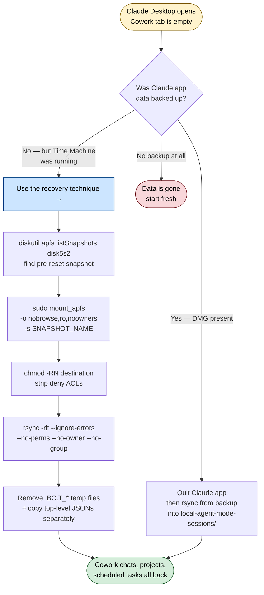

# macOS Reset Survival Guide

> Everything I learned wiping and restoring my Mac in 2026 — including the part where I almost lost my AI chat history, and how I got it back.

This repo is the post-mortem of a real Mac reset and restore. It contains the scripts I actually ran, the things that broke, the things I figured out, and the things I wish someone had told me first. If you're about to do a clean install on macOS Sequoia or newer, this should save you several hours and at least one minor panic attack.

## Reset day at a glance

```mermaid
gantt
    title 75-minute Mac clean install + restore
    dateFormat HH:mm
    axisFormat %H:%M

    section Pre-flight
    Sign out of iCloud / iMsg / FaceTime / App Store     :preflt, 00:00, 5m

    section Erase + Setup
    Erase All Content and Settings (passive)             :erase, after preflt, 10m
    Setup Assistant (don't use Migration Assistant)      :setup, after erase, 10m

    section Restore
    Sign into Mac App Store (required before brew bundle):mas, after setup, 2m
    restore.sh (Homebrew, casks, configs, app state)     :crit, restore, after mas, 30m

    section Sign-ins
    ssh-add, gh auth, GitHub Desktop bulk-add (1.5s/repo):signins, after restore, 8m
    Cloud apps (Dropbox, VS Code Sync, Slack, etc.)      :clouds, after signins, 12m

    section Verify
    verify-setup.sh + System Settings perms              :ver, after clouds, 8m
```



## When Cowork is empty after a reset



Full step-by-step is in [`docs/02-cowork-recovery.md`](docs/02-cowork-recovery.md).

---

## The TL;DR

After a clean install of macOS, my goal was simple: get back to "productive in code" in under two hours, without bringing forward years of OS cruft. I had three external-drive backups: an encrypted DMG of my creds + dotfiles + select app state, a 43 GB rsync mirror of my code (no `node_modules`), and Time Machine on a separate volume.

**It mostly worked.** Restore script ran, code came back, configs landed. Then I opened Claude Desktop and **Cowork was completely empty** — no scheduled tasks, no projects, no chat history under that tab. The local files I'd backed up didn't cover the AI app's data dir. What followed was 90 minutes of digging through APFS snapshots, fighting macOS ACLs, and ultimately a clean recovery thanks to one piece of luck: Time Machine had snapshotted the volume right before the wipe.

This repo captures both the working scripts and the recovery technique.

## What's in here

```
scripts/
├── restore.sh             # The post-clean-install restore script (run with T9-style external drive)
├── export-credentials.sh  # Builds the encrypted backup DMG (run BEFORE the reset)
├── mirror-to-t9.sh        # Rsync your code dir, excluding regenerable cruft
├── verify-setup.sh        # Post-restore sanity check (24 green checkmarks if you did it right)
└── Brewfile               # Curated formulae + casks (lessons learned baked in)

docs/
├── 01-lessons-learned.md  # 23 distinct things that broke or surprised me
├── 02-cowork-recovery.md  # The APFS snapshot mounting + ACL stripping technique
├── 03-claude-app-paths.md # What to back up for Claude Desktop / Cowork users
└── 04-reset-day-playbook.md  # The ordered, time-budgeted checklist
```

## Who this is for

- Anyone doing a clean macOS install and wants a tested playbook
- **Claude Desktop / Cowork users** — Anthropic doesn't include those paths in any backup tool I'm aware of, and the data lives locally. If you reset without preparing, you can lose months of scheduled task history.
- Developers who use Homebrew + a mix of MAS apps + GUI casks and want a repeatable Brewfile
- Anyone whose `tmutil listbackups` shows entries that "don't exist" (spoiler: they're APFS snapshots, here's how to mount them)

## The narrative

If you have 15 minutes, read [`docs/01-lessons-learned.md`](docs/01-lessons-learned.md) — it's the story of what went wrong, what fixed each thing, and what I changed in the scripts so it doesn't happen next time.

If you just want to run things, the [Reset-day playbook](docs/04-reset-day-playbook.md) is the time-budgeted checklist.

If you're specifically here for "I wiped my Mac and Claude Desktop's Cowork is empty, can I get it back?" — go straight to [`docs/02-cowork-recovery.md`](docs/02-cowork-recovery.md).

## Highlights

A few of the lessons worth knowing even if you never need this guide:

- **`tmutil listbackups` shows phantom paths**: the entries are real APFS snapshots inside the backup volume, but `/Volumes/.timemachine/<UUID>/<date>.backup/` doesn't auto-mount them. Use `diskutil apfs listSnapshots <disk>` to find them, then `mount_apfs -o nobrowse,ro,noowners -s <snapshot-name> <device> <mountpoint>` to mount.
- **macOS ACLs can deny even root** on read-only TM snapshots. `ditto` fails silently on these — even though the files are owned by your user. `chmod -RN <dest>` strips ACLs from the destination, then `rsync` without `--xattrs`/`--acls` works.
- **iCloud Documents Sync stores 0-byte placeholders locally** by default. TM backups capture the placeholders, not the content. macOS's `~/iCloud Drive (Archive)` folder is your only on-device fallback for files that had been downloaded before sync was disabled.
- **`brew bundle install`'s npm step runs in a non-interactive shell** with no `node@24` on PATH. Every `npm "<pkg>"` line fails with `env: node: No such file or directory`. Fix: `export PATH="/opt/homebrew/opt/node@24/bin:$PATH"` before running it.
- **docker-desktop cask fails without sudo pre-creating `/usr/local/cli-plugins`**. Brew can't prompt for sudo non-interactively. Add `sudo mkdir -p /usr/local/cli-plugins && sudo chown $USER /usr/local/cli-plugins` to your restore script.
- **`mas` (Mac App Store CLI) silently skips entries if you're not signed into the App Store**. There's no error. Sign in via System Settings → Apple ID before running `brew bundle install`.
- **GitHub Desktop's repo list isn't portable across Macs** (LevelDB lock files are machine-specific, auth is in Keychain). But the brew-installed `github` CLI shim accepts a directory and adds it to a running Desktop. Loop `find ~/code -maxdepth 3 -name .git | sed 's|/.git$||' | while read r; do github "$r"; sleep 0.3; done` to bulk-add. Throttle the sleep — Desktop's IPC drops messages under burst.
- **Stable account UUIDs in Claude Desktop** mean the Cowork recovery is just a copy, not a rename — the directory structure `local-agent-mode-sessions/<account-uuid>/<sub-uuid>/` uses the same UUIDs on the new device after sign-in.
- **Firefox 138+ silently superseded `profiles.ini`** with a new "Profile Groups" SQLite system. Restoring profiles the old way doesn't surface them in the new built-in picker. Fix: write a one-line `user.js` (`browser.profiles.enabled = false`) into each restored profile to fall back to legacy behavior.
- **GitHub Desktop splits persistence** between Local Storage (last-selected-repo pointer) and IndexedDB (actual repo list). Bulk-adding via the brew `github` CLI shim only persists fully if Desktop is **already running** during the loop AND there's enough throttle (~1.5s) between calls for each IndexedDB write to settle.

There are 17 more in [`docs/01-lessons-learned.md`](docs/01-lessons-learned.md).

## Generalizing this

These scripts use a Samsung T9 SSD with two APFS volumes (`T9 Files` for the DMG + code mirror, `T9 Backup` for Time Machine), but the approach generalizes:

1. Run [`mirror-to-t9.sh`](scripts/mirror-to-t9.sh) **before** the reset — it rsyncs your code dir excluding `node_modules`, `dist`, `.next`, `.venv`, etc. Just change `T9` to wherever you want the mirror.
2. Run [`export-credentials.sh`](scripts/export-credentials.sh) **before** the reset — it produces an encrypted DMG of credentials + dotfiles + curated app state.
3. Wipe and reinstall macOS. Don't use Migration Assistant from the old Mac (defeats the point of a clean install).
4. Run [`restore.sh`](scripts/restore.sh) from the external drive after first boot — it brings everything back.
5. Run [`verify-setup.sh`](scripts/verify-setup.sh) when restore is done — it pass/warn/fail-checks every major piece.

## End state

After running this end-to-end:

- ~90 min hands-on (longest single block: the code rsync, ~20 min over USB)
- 24-of-24 green checkmarks in verify-setup.sh
- No re-entry of saved DB passwords (auto-restored where possible; only the macOS Keychain layer needs re-entry)
- Cowork data restored — even when the backup script missed it the first time
- GitHub Desktop showing all repos
- Browser, password manager, work apps all signed in via their own cloud sync

## License

MIT — fork it, adapt it, ship it. The scripts have a few opinionated defaults (Node 24, Python 3.13, the specific MAS app IDs I happen to use) — those are easy to swap.

If this saves you an hour, that's a good outcome. If you find a lesson #24, [open an issue](../../issues) and tell me what broke.

---

*Captured during an actual 2026 macOS reset on Apple Silicon (M4). Tested end-to-end, including the Cowork recovery part.*
